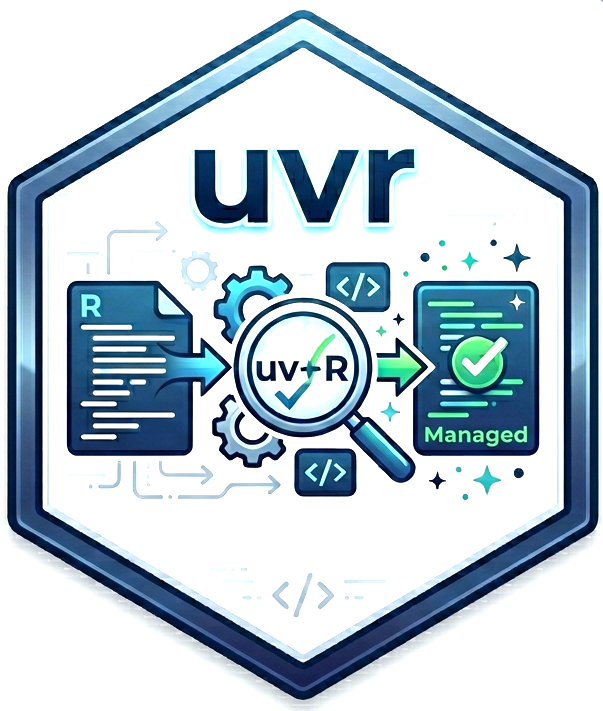

# uvr 

<!-- badges: start -->
[](LICENSE)
<!-- badges: end -->

R companion package for [uvr](https://github.com/nbafrank/uvr), the fast R package and project manager written in Rust.

Use `uvr` functions directly from your R console or RStudio/Positron — no terminal needed.

## Installation

```r
# Install from GitHub
# install.packages("pak")
pak::pak("nbafrank/uvr-r")
```

Or install from a local clone:

```r
install.packages("path/to/uvr-r", repos = NULL, type = "source")
```

The first time you call any `uvr` function, if the CLI binary is not found you'll be prompted to install it automatically.

## Usage

```r
library(uvr)

# Start a new project
init()

# Add packages (CRAN, Bioconductor, GitHub)
add("ggplot2")
add("dplyr")
add(c("DESeq2", "GenomicRanges"), bioc = TRUE)
add("user/repo@main")

# Install everything from the lockfile
sync()

# Upgrade all packages to latest versions
lock(upgrade = TRUE)
sync()

# Run a script in the isolated environment
run("analysis.R")

# Remove packages
remove_pkgs("ggplot2")
```

## Functions

| Function | CLI equivalent | Description |
|----------|---------------|-------------|
| `init()` | `uvr init` | Create a new uvr project |
| `add()` | `uvr add` | Add packages to the project |
| `remove_pkgs()` | `uvr remove` | Remove packages |
| `sync()` | `uvr sync` | Install all packages from lockfile |
| `lock()` | `uvr lock` | Re-resolve deps, update lockfile |
| `run()` | `uvr run` | Run a script in the project env |
| `install_uvr()` | — | Install/update the uvr CLI binary |

### Key arguments

```r
# Version constraints
add("tidymodels@>=1.0.0")

# Dev dependencies
add("testthat", dev = TRUE)

# Bioconductor
add("DESeq2", bioc = TRUE)

# CI mode — fail if lockfile is stale
sync(frozen = TRUE)

# Upgrade all packages
lock(upgrade = TRUE)

# Forward args to script
run("analysis.R", args = c("--input", "data.csv"))
```

## How it works

Each function shells out to the `uvr` CLI binary. The package automatically:

1. **Finds** the `uvr` binary on your PATH or in common install locations (`~/.cargo/bin/`, `~/.local/bin/`)
2. **Caches** the path for the session (no repeated lookups)
3. **Prompts** to install the binary if not found (interactive sessions only)

The binary does the heavy lifting — resolving dependencies, downloading P3M pre-built binaries, managing the lockfile, and maintaining the isolated per-project library.

## Requirements

- R >= 4.1.0
- The `uvr` CLI binary ([install instructions](https://github.com/nbafrank/uvr#installation))
- Optional: `jsonlite` (for downloading pre-built binaries via `install_uvr()`)

## Related

- [uvr](https://github.com/nbafrank/uvr) — the CLI tool and full documentation
- [uvr on r/rstats](https://www.reddit.com/r/rstats/) — community discussion

## License

MIT
