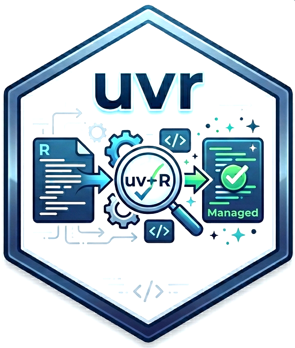

# uvr 

<!-- badges: start -->
[](LICENSE)
[](https://github.com/nbafrank/uvr-r/actions/workflows/R-CMD-check.yaml)
[](https://app.codecov.io/gh/nbafrank/uvr-r)
<!-- badges: end -->

R companion package for [uvr](https://github.com/nbafrank/uvr), the fast R package and project manager written in Rust.

Use `uvr` functions directly from your R console or RStudio/Positron — no terminal needed.

## Installation

```r
# Install from GitHub
# install.packages("pak")
pak::pak("nbafrank/uvr-r")
```

Or install from a local clone:

```r
install.packages("path/to/uvr-r", repos = NULL, type = "source")
```

The first time you call any `uvr` function, if the CLI binary is not found you'll be prompted to install it automatically.

## Usage

```r
library(uvr)

# Start a new project
init()

# Add packages (CRAN, Bioconductor, GitHub)
add("ggplot2")
add("dplyr", do_lock = FALSE) # skip lock + install
add("dplyr", do_install = FALSE) # skip install
add(c("DESeq2", "GenomicRanges"), bioc = TRUE)
add("user/repo@main")

# Install everything from the lockfile
sync()

# Upgrade all packages to latest versions
lock(upgrade = TRUE)
sync()

# Run a script in the isolated environment
run("analysis.R")

# Remove packages
remove_pkgs("ggplot2")
```

## Functions

| Function | CLI equivalent | Description |
|----------|---------------|-------------|
| `init()` | `uvr init` | Create a new uvr project |
| `add()` | `uvr add <packages> <--no-lock> <--no-install>` | Add packages to the project |
| `remove_pkgs()` | `uvr remove` | Remove packages |
| `sync()` | `uvr sync` | Install all packages from lockfile |
| `lock()` | `uvr lock` | Re-resolve deps, update lockfile |
| `update_pkgs()` | `uvr lock --upgrade && uvr sync` | Upgrade and install all packages |
| `cache_clean()` | `uvr cache clean <--package> <--r-version>` | Delete cached package installs and tarballs, optionally filtered |
| `completions()` | `uvr completions <shell>` | Generate shell completions (bash, zsh, fish, powershell) |
| `doctor()` | `uvr doctor ` | Diagnose environment issues (R, build tools, project status) |
| `export()` | `uvr export` | Export renv.lock file built from uvr.toml |
| `import()` | `uvr import` | Import renv.lock file to build uvr.toml |
| `run()` | `uvr run` | Run a script in the project env, or a standalone script from its own header |
| `tree()` | `uvr tree <--depth>` | Show the dependency tree |
| `scan()` | `uvr scan <--all>` | Find packages your code uses but `uvr.toml` doesn't declare |
| `activate()` | `uvr activate <--write-shim>` | Print how to activate the project in a shell |
| `install_uvr()` | — | Install the uvr CLI binary |
| `update_uvr()` | — | Update both R package (from GitHub) and CLI binary |
| `r_install()` / `r_list()` / `r_use()` / `r_pin()` | `uvr r ...` | Manage R versions |

### Standalone scripts

From uvr 0.4.6 a script can declare its own dependencies in a header
comment and run without a project — `run()` handles these too:

```r
# analysis.R
# /// script
# dependencies = ["jsonlite", "praise"]
# ///
cat(praise::praise(), "\n")
```

```r
run("analysis.R")   # installs into a cached env, no uvr.toml needed
```

Dependencies install into an environment keyed by the dependency set, so
repeat runs start immediately and nothing is written beside the script.
The script is isolated from any project you happen to be in: the project
library, its `.r-version` pin and its `.Rprofile` are all bypassed.

### Key arguments

```r
# Version constraints
add("tidymodels@>=1.0.0")

# Dev dependencies
add("testthat", dev = TRUE)

# Bioconductor
add("DESeq2", bioc = TRUE)

# CI mode — fail if lockfile is stale
sync(frozen = TRUE)

# Upgrade all packages
lock(upgrade = TRUE)

# Forward args to script
run("analysis.R", args = c("--input", "data.csv"))

# Clean the cache selectively (uvr >= 0.4.2)
cache_clean(package = "sf")

# See what will install, and from where, before it runs (uvr >= 0.4.6)
sync(plan = TRUE)

# Build from source instead of using pre-built binaries
add("sf", no_binary = TRUE)

# Let uvr install missing system libraries (needs root/sudo; shows the plan first)
sync(install_system_deps = TRUE)

# Find dependencies your code uses but never declared
scan()

# Rolling R channels, and a custom install location (uvr >= 0.4.6)
r_install("devel")
r_install("4.5.1", install_dir = "/opt/R")
cache_clean(r_version = "4.4")

# Force progress spinners (hidden by default: R pipes uvr's output)
sync(progress = "always")

# Slow connection? Give the binary download more time
install_uvr(timeout = 300)
```

## How it works

Each function shells out to the `uvr` CLI binary. The package automatically:

1. **Finds** the `uvr` binary on your PATH or in common install locations (`~/.cargo/bin/`, `~/.local/bin/`)
2. **Caches** the path for the session (no repeated lookups)
3. **Prompts** to install the binary if not found (interactive sessions only)

The binary does the heavy lifting — resolving dependencies, downloading P3M pre-built binaries, managing the lockfile, and maintaining the isolated per-project library.

## Requirements

- R >= 4.1.0
- The `uvr` CLI binary ([install instructions](https://github.com/nbafrank/uvr#installation))
- Optional: `jsonlite` (for downloading pre-built binaries via `install_uvr()`)

## Related

- [uvr](https://github.com/nbafrank/uvr) — the CLI tool and full documentation
- [uvr on r/rstats](https://www.reddit.com/r/rstats/) — community discussion

## Support

uvr is free and MIT-licensed. If it saves you time, you can support its
development on [Ko-fi](https://ko-fi.com/nbafrank).

## License

MIT
